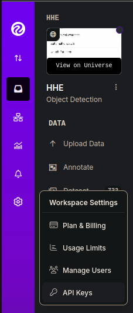

# RRFxx_icon_detection

## How to Run

### 1. Create a Roboflow Account

* [Sign up for a free Roboflow account](https://universe.roboflow.com/).

### 2. Obtain Private API Key

* After signing in, navigate to the Roboflow settings page, and copy your  **Private API Key** .
* Roboflow Interface Preview



### 3. Configure the API Key

1. Create a file named `roboflow_api_key.text` in the root directory of your project.
2. Paste the copied API Key into the file and save it.

### 4. Download the Dataset

* Download the target dataset [Type-3](https://universe.roboflow.com/hhe-3jp9r/hhe/dataset/6).

  ```
  python3 -m Download_dataset.py
  ```

### 5. Install Dependencies

* Run the installation script to set up the required environment and dependencies:

  ```
  bash install.sh
  ```

### 6. Start Training the Model

* Execute the following command to start training the YOLO model:

  ```
  python run/yolo_train.py
  ```

### 7. Export to ONNX & NCNN

```
python runs/yolo_export_onnx_ncnn.py
```

Deploying Exported YOLO11 NCNN Models

After successfully exporting your Ultralytics YOLO11 models to NCNN format, you can now deploy them. The primary and recommended first step for running a NCNN model is to utilize the YOLO("./model_ncnn_model") method, as outlined in the previous usage code snippet. However, for in-depth instructions on deploying your NCNN models in various other settings, take a look at the following resources:

* **[Android](https://github.com/Tencent/ncnn/wiki/how-to-build#build-for-android)** : This blog explains how to use NCNN models for performing tasks like [object detection](https://www.ultralytics.com/glossary/object-detection) through Android applications.
* **[macOS](https://github.com/Tencent/ncnn/wiki/how-to-build#build-for-macos)** : Understand how to use NCNN models for performing tasks through macOS.
* **[Linux](https://github.com/Tencent/ncnn/wiki/how-to-build#build-for-linux)** : Explore this page to learn how to deploy NCNN models on limited resource devices like Raspberry Pi and other similar devices.
* **[Windows x64 using VS2017](https://github.com/Tencent/ncnn/wiki/how-to-build#build-for-windows-x64-using-visual-studio-community-2017)** : Explore this blog to learn how to deploy NCNN models on windows x64 using Visual Studio Community 2017.

## Hardware Requirements

The recommended hardware specifications are as follows:

* **CPU** : Intel 4-Core
* **GPU** : Nvidia GeForce RTX 2070 Mobile (8GB VRAM)
* **RAM** : 32GB
* **SSD** : PCIe 500GB

## Software Requirements

The software environment requirements are as follows:

* **Operating System** : Ubuntu 22.04
* **CUDA** : 11.8
* **cuDNN** : 8.x
* **Anaconda or miniconda**

## Path

```
RRFxx_icon_detection/
├── DataSet
│   ├── test
│   │   ├── images
│   │   │   └── *.png
│   │   └── labels
│   │   │   └── *.txt
│   ├── train
│   │   ├── images
│   │   │   └── *.png
│   │   └── labels
│   │   │   └── *.txt
│   ├── vaild
│   │   ├── images
│   │   │   └── *.png
│   │   └── labels
│   │   │   └── *.txt
│   └── data.yaml
├── image
│   └── README
│       └── roboflow.png
├── install.sh
├── LICENSE
├── README.md
├── requirements.txt
├── roboflow_api_key.tex
├── urls.text
├── yolo11n.pt
├── yolo_train.py
├── yolov8m.pt
├── yolov8n.pt
└── yolov8x.pt
```

## Notes

* Ensure your GPU supports the specified CUDA version.
* Verify the integrity of the dataset during download to avoid interruptions.
* If installation errors occur, check the `install.sh` script for proper setup of dependencies.
